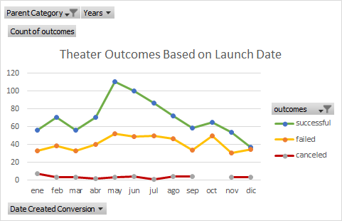
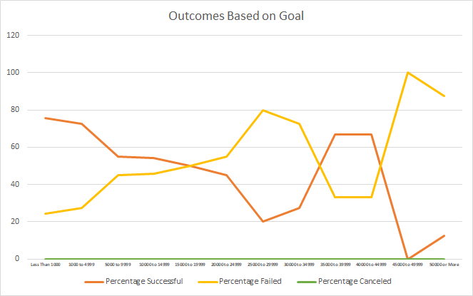

#### Challenge 1: Module 1 
# Kickstarting with Excel

## Overview of Project

### Purpose
The purpose of the project is based on obtaining valuable information from some data using different Excel tools. Some skills learned during Module 1 were used to complete the analysis and represent data to have a better visualization of the results. 
The results of the analysis will help to see how campaigns went according to their funding goals and the date of launch, having some guide to see if Louise's play is going to be successful according to the plan. In this case, the main goal is to obtain the best day for launching the play and the most appropriate funding goal. 

## Analysis and Challenges

### Analysis of Outcomes Based on Launch Date
One of the analyses focuses on the launch date and the number of the different outcomes. The first result to notice is that the number of canceled plays is relatively low during the years and that there is not a lot of difference between them in each month. Most of the planned plays are executed, no matter the result. 
On the other hand, the number of successful plays changed notoriously in each month as can be seen in Graph 1. May is the month with the highest number of successful plays between 2009 to 2017. There is a big difference between April and May, the increase of successful plays is notorious. Approximately 67% of the plays in May were successful.
The successful and failed outcome lines have similarities in their behavior. There is a little increment at the beginning, the next month returns to the same value that it had at the first month and then there is a major increment followed by a decrease of values. The response tells us that there are a lot of plays in May and that there are few plays launched in December. The percentage of having a successful outcome in December is 49%, being 51% the percentage of having either canceled or failed as outcomes.

### Analysis of Outcomes Based on Goals
The other important analysis is the Outcomes based on Goals. The percentage of plays canceled were always zero, and can be concluded that there were no canceled plays with funding goals. A green vertical line showing the percentage of plays canceled can be seen on the bottom of the Graph 2., located at value zero.
At the beginning of this graph, the highest percentage of successful outcomes and the lowest percentage of failed outcomes is presented where the goal of funding is less than 1000. Both lines, the one of "Percentage Successful" and the line of "Percentage Failed", show an opposite behavior. When the amount of money is low, there is the highest percentage of successful plays and the lowest percentage of failed plays. While at the highest amounts of money, the percentage of failed plays is the highest and the percentage of successful plays is the lowest. 
Another relevant result is that there is an increase of successful plays and a decrease of failed plays between $35000 and $44999. It is a great amount of money and the range is huge, which makes it a great range for success. The range of money to avoid is $25000 to $29999, because the percentage of failed plays is high and the percentage of successful plays is low. The percentage of success is just 20% and the percentage of failed is 80%. Both values show that probabilities of success are quite reduced.

### Challenges and Difficulties Encountered
The Excel tools are easy when the user is acquainted with the software and works constantly with it. Working with some advanced tools like Pivot Tables can be tricky at the beginning. One of the difficulties encountered is the location of data on "Filters", "Columns", "Rows" and "Values" fields during the creation of the Pivot Table. Trying all the possible combinations, made the arrangement visible.
The most significant challenge presented during the project was the analysis of the data on the tables. The results were there, but trying to understand, find out relations between them and explain all with words was challenging. The constant visualization of tables and graphs helped to create relations with the results and the behaviors, and finally conclude which was the best option.

## Results

### Conclusions about the Outcomes based on Launch Date
We can conclude from the analysis of the Outcomes based on Launch Date that most of the plays launched during 2009 and 2017 were successful, where only 36% of total were failed and 3% were canceled. 
It is important to analyze the better month to launch a play according to past events. We could say that May is the best option to launch a play because there is more probability of being successful. The outcome of launching a play during December has a probability similar to tossing a coin in the air, being December most unappropriate month to launch a play.

### Conclusions about the Outcomes based on Goals
It is important to determine a goal of funding based on real and possible numbers. One conclusion obtained by the analysis of Outcomes based on Goals is that the most recommended goal is between $35000 and $44999. It is a great amount of money and the percentage of being successful is 67%. It is not the highest value but it is more than half of the possibilities of having a great outcome. Using the highest percentage of successful plays means an amount less than $1000, that may not be enough.

### Limitations of the dataset
Some bias and limitations of the dataset could be that there is just the final data with no explanation and the user doesn't know if there was something going on at that specific time or the real reason why the outcomes ended like that. For example, it is impossible to know if there was any inconvenience with the play itself being the real reason for its failure. Also, there is no record of important events that changed the real outcomes. If the dataset had a lot of information or specifications, it could be easier to understand the relations between the results. Although, having that amount of data could make the analysis more confused.

### Possible tables and graphs
The creation of more tables and graphs make it easier to understand, visualize the results and understand the behavior of the data. According to the first analysis, another graph showing the outcomes based on the launch date but according to the years could be suitable to compare and analyze if there is some relation between months, and comparing the same months in different years. In the actual graph, there is a filter where the year can be specified but being able to see all the specific years in one graph could be helpful for data verification.  
Also doing a table and graph showing the start and end of some successful and failed plays, analyze if there is a relation between the duration of the plays and the outcomes. Trying to analyze all the obtained data with the outcomes could show more specific relations. 
